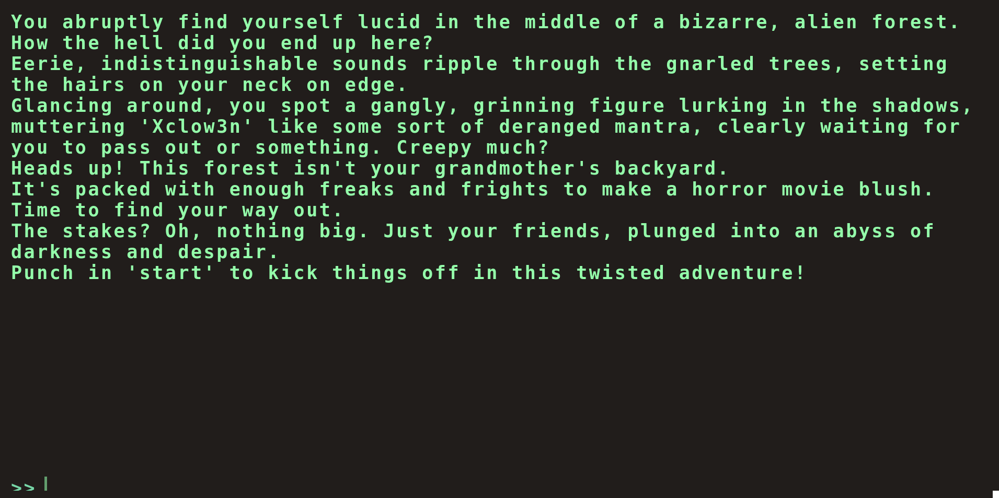
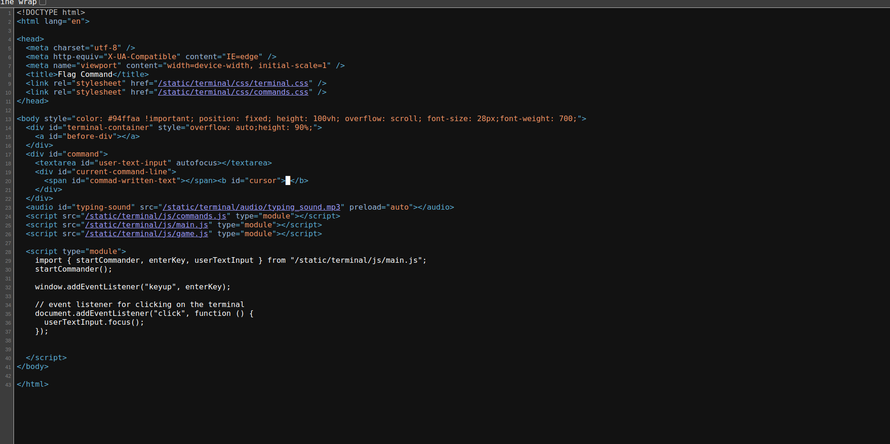
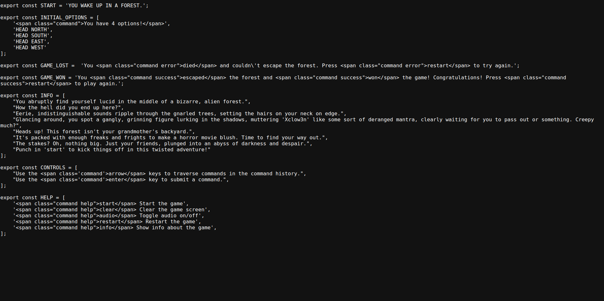
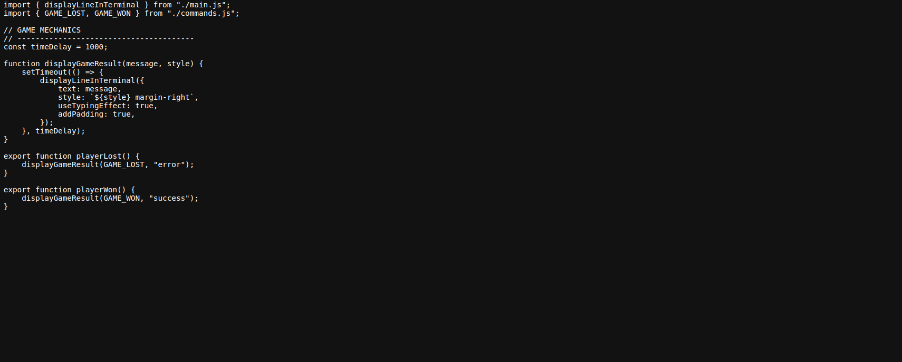
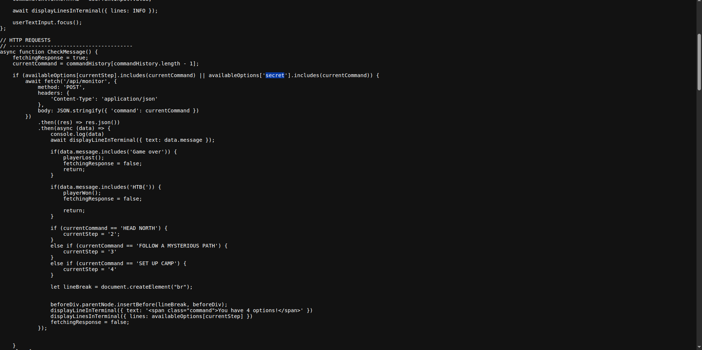
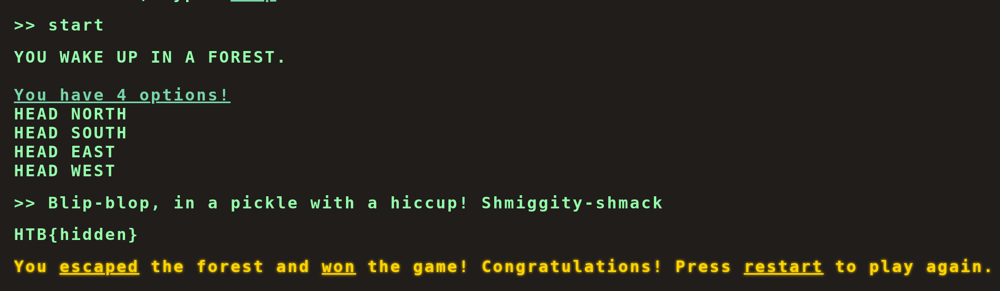

# Writeup 

## Exploration



Seeing such massive info dump, i first tried to find the flag by viewing the developer tools:



There are three script sources:

- "commands.js"
- "main.js"
- "game.js"

Visiting each of them:



-> Nothing interesting

-> Nothing interesting


-> Seems to be interesting at 
``` javascript

    if (availableOptions[currentStep].includes(currentCommand) || availableOptions['secret'].includes(currentCommand)) {
        await fetch('/api/monitor', {
            method: 'POST',
            headers: {
                'Content-Type': 'application/json'
            },
            body: JSON.stringify({ 'command': currentCommand })
        })
            .then((res) => res.json())
            .then(async (data) => {
                console.log(data)
                await displayLineInTerminal({ text: data.message });

                if(data.message.includes('Game over')) {
                    playerLost();
                    fetchingResponse = false;
                    return;
                }

                if(data.message.includes('HTB{')) {
                    playerWon();
                    fetchingResponse = false;

                    return;
                }

```
and 

``` javascript
const fetchOptions = () => {
    fetch('/api/options')
        .then((data) => data.json())
        .then((res) => {
            availableOptions = res.allPossibleCommands;

        })
        .catch(() => {
            availableOptions = undefined;
        })
}
```
But where could the 'secret' be? We check "options" by curling the "/api/options"

``` bash
curl $URL/api/options
```
We then found the secret, which is:

``` json
{
  "allPossibleCommands": {
    "1": [
      "HEAD NORTH",
      "HEAD WEST",
      "HEAD EAST",
      "HEAD SOUTH"
    ],
    "2": [
      "GO DEEPER INTO THE FOREST",
      "FOLLOW A MYSTERIOUS PATH",
      "CLIMB A TREE",
      "TURN BACK"
    ],
    "3": [
      "EXPLORE A CAVE",
      "CROSS A RICKETY BRIDGE",
      "FOLLOW A GLOWING BUTTERFLY",
      "SET UP CAMP"
    ],
    "4": [
      "ENTER A MAGICAL PORTAL",
      "SWIM ACROSS A MYSTERIOUS LAKE",
      "FOLLOW A SINGING SQUIRREL",
      "BUILD A RAFT AND SAIL DOWNSTREAM"
    ],
    "secret": [
      "Blip-blop, in a pickle with a hiccup! Shmiggity-shmack"
    ]
  }
}
```

Inputing the secret into the website, we get the flag!


