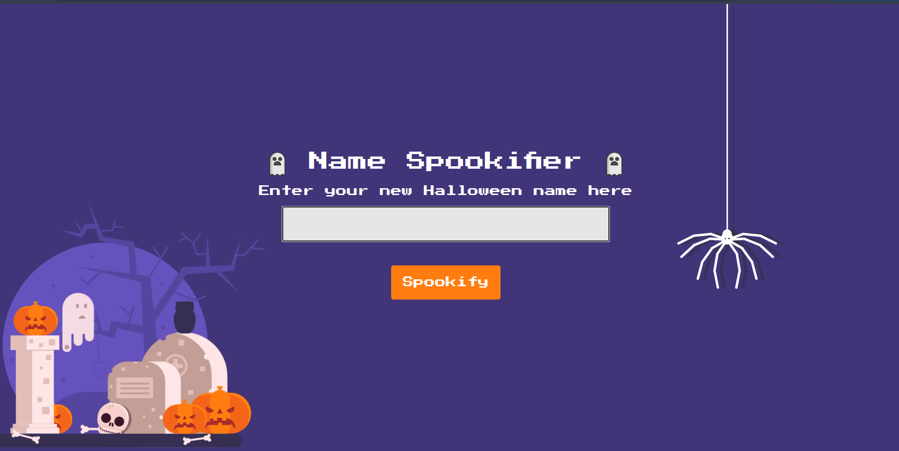
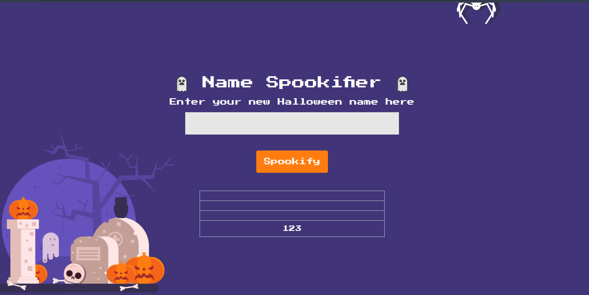
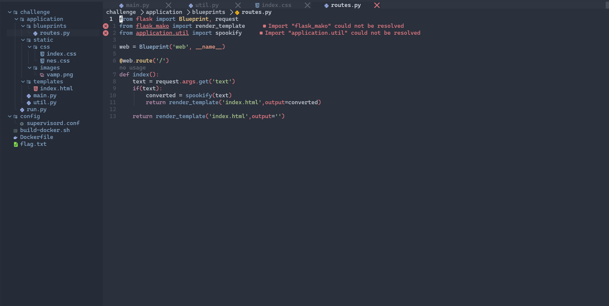
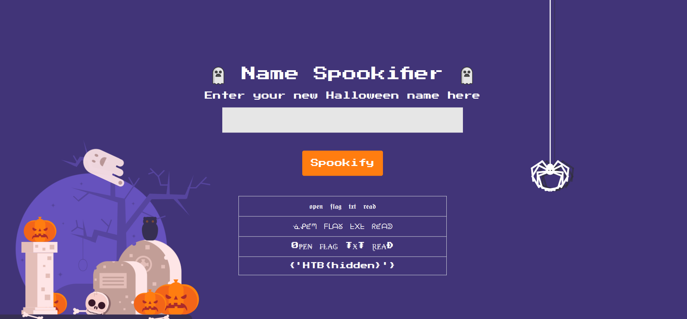

# Writeup for Spookifier

## Discovery

We can see here at the web UI, a input field for 'name'



After inputting a random '123', we can see the output is reflected back at us, which makes me think of a attack vector that is a SSTI vulnerability.



Looking at the source code given, we can determine that the web app is using Mako as the template engine, and the input is being passed to the template without any sanitization. This means we can inject Mako syntax directly into the input field.



## Attack

After some searching, i found a payload that can successfully find the flag:
``` python
${{open('../flag.txt').read()}}
```



-> Voila! We have found the flag

