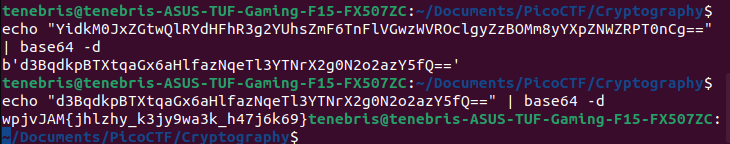

# Write Up

The key given is : YidkM0JxZGtwQlRYdHFhR3g2YUhsZmF6TnFlVGwzWVROclgyZzBOMm8yYXpZNWZRPT0nCg==

Can phai dao nguoc 2 lan bang base64 -d



Roi su dung caesar cypher de giai ma hoa:

``` python

text = "wpjvJAM{jhlzhy_k3jy9wa3k_h47j6k69}"
k = 0

while k <= 50:
    flag = ''
    for i in range(len(text)):
        if (text[i] != '{' and text[i] != '}'):
            if (text[i].islower()):
                flag += chr((ord(text[i]) + k - 97) % 26 + 97)
            elif(text[i].isupper()):
                flag += chr((ord(text[i]) + k - 65) % 26 + 65)
            else:
                flag += text[i]
        else:
            flag += text[i]
    print(flag)
    k += 1
    print(k)
=
```